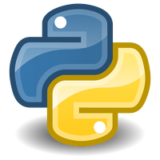

  

<h3 align="center">My stack</h3>

	
	
	
	
	
	
	
	
	
	
	

<h3 align="left">About me</h3>

I've been learning to code for 5 months after switching careers. I started with HTML/CSS, but have really found a passion for automation QA and backend development with Python=)

* 🌍  I'm based in Moscow and Yerevan
* ✉️  You can contact me at [a.abazyan@bk.ru](mailto:a.abazyan@bk.ru)
* 📟 Or via telegram [di_stucco](https://t.me/di_stucco)
* 🧠  I'm learning Python, Pytest, Selenium, Selene, Allure and Appium
* 🤝  I'm open to collaborating on interesting projects

### Education

 <table style="width=100%" cellspacing="0" cellpadding="5">
    <tr >
        <td align="center"></td>
        <td>Automation engineer school QA.GURU.</td>
        <td>2022</td>
    </tr>
    <tr >
        <td align="center"></td>
        <td>Python development</td>
        <td>2022-2023</td>
    </tr>
    <tr>
        <td align="center">
            
        </td>
        <td>
            Self-study
          <b>Javac Core, Python, etc.</b>
        </td>
        <td>Since 2021</td>
    </tr>
    <tr>
</table>

